# Advanced Responsive To-Do App

A polished, recruiter-friendly productivity dashboard built as a front-end web app. It combines task management, focus mode, analytics, drag-and-drop workflow, recurring tasks, reminders, confirmation safeguards, and smart productivity insights in one responsive interface.

## LIVE DEMO

https://rohaan2802.github.io/TODO-Web-App/

## Feature screenshots

Below are **15 tightly cropped screenshots** - each shows only the UI for that heading (no full-page chrome, side margins, or empty background).

### 1. Dashboard overview

Full productivity workspace: top bar, metrics, insights, analytics, task composer, filters, board, and task list in one view.

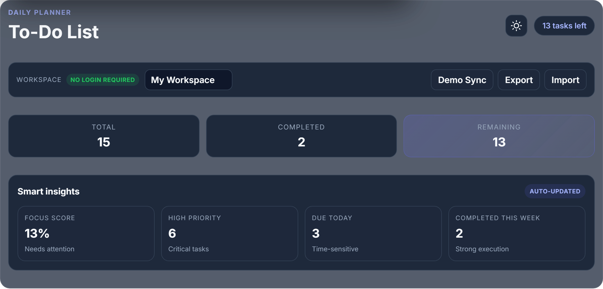

### 2. Summary metrics

Live counters for **Total**, **Completed**, and **Remaining** tasks so progress is visible at a glance.

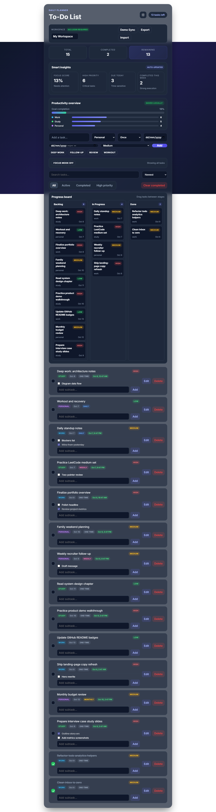

### 3. Smart insights

Auto-updated insight cards for focus score, high-priority load, due-today pressure, and weekly completions.

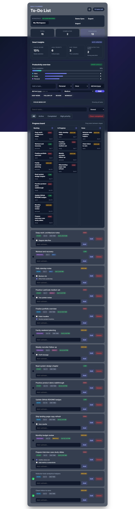

### 4. Productivity overview

Goal completion progress bar plus category breakdown (work / personal / study) for workload balance.

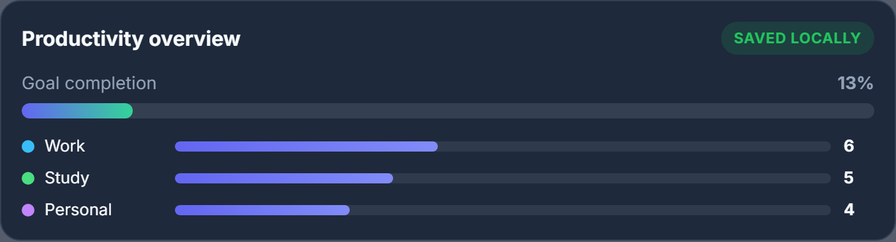

### 5. Add task form

Create tasks with title, category, recurrence, due date, reminder, and priority in one composer.

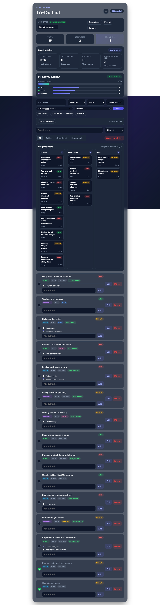

### 6. Quick shortcuts

One-click pills for frequent workflows (deep work, follow-up, review, workout) without retyping.

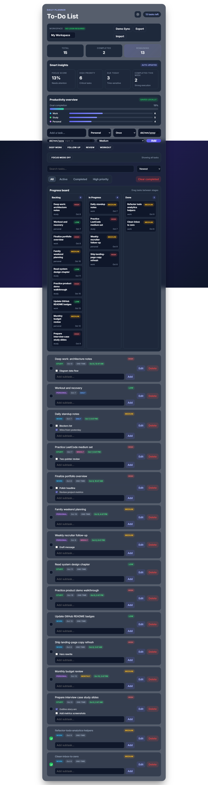

### 7. Focus mode

Focus mode hides clutter and keeps only today's active priorities visible.

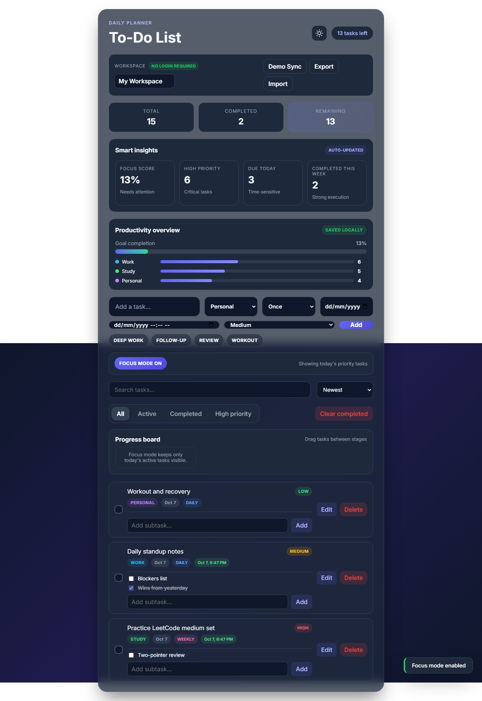

### 8. Search and sort

Keyword search plus sorting by newest, oldest, priority, or due soon.

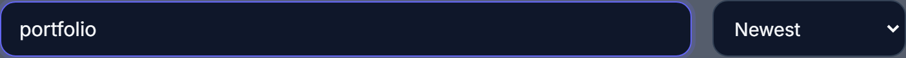

### 9. Filters (high priority)

Global tabs for All / Active / Completed / High priority to slice the backlog instantly.

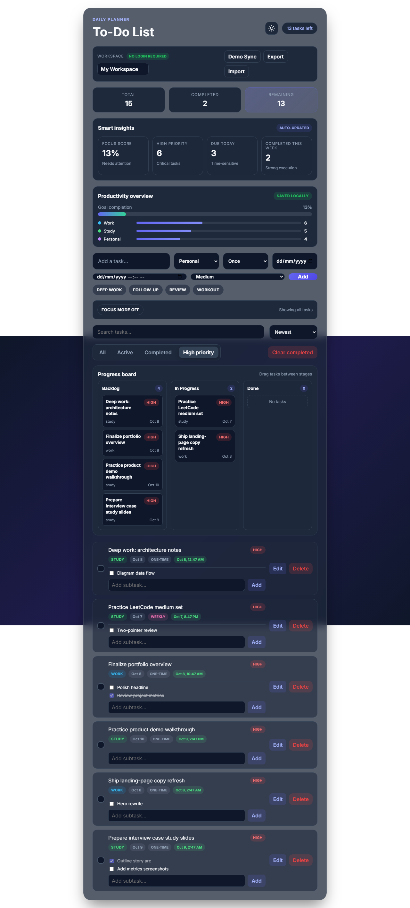

### 10. Progress board

Kanban-style board with **Backlog -> In Progress -> Done**. **Backlog** = not started / queued. **In Progress** = currently being worked. **Done** = finished. Drag cards between columns to move work.

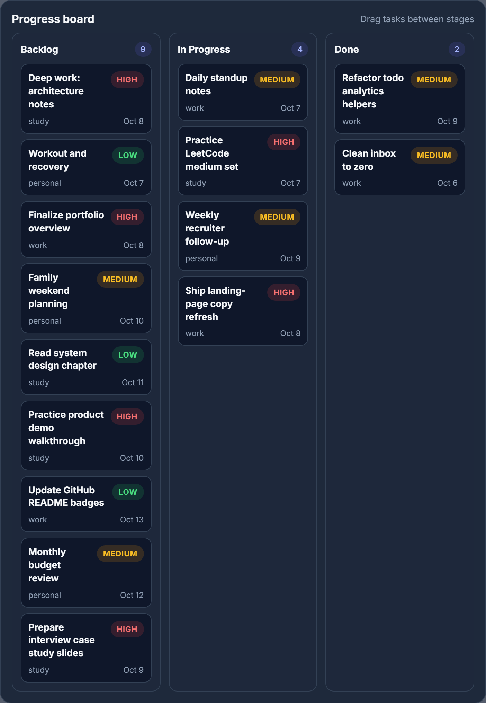

### 11. Task list details

Rich task cards with priority badges, categories, due dates, recurrence labels, reminders, and nested subtasks.

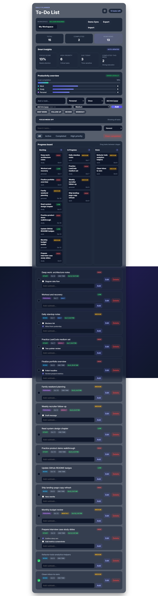

### 12. Recurring due-date roll-forward

Only tasks marked **Daily / Weekly / Monthly** do this. Checking the box does **not** permanently complete them - the **due date extends** to the next cycle and the task stays active. **Once** tasks complete normally with no date change.

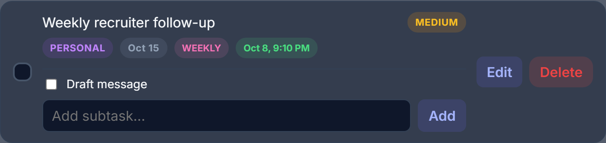

### 13. Delete confirmation

Delete asks for permission first with **OK / Cancel** so accidental removals are blocked.

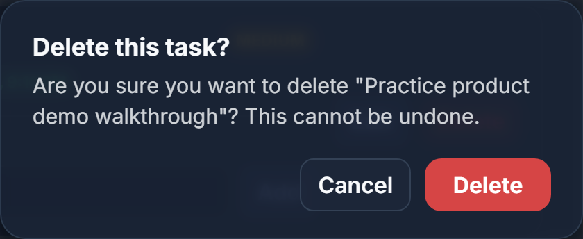

### 14. Edit confirmation

Edit also asks for confirmation before entering edit mode and again before saving changes.

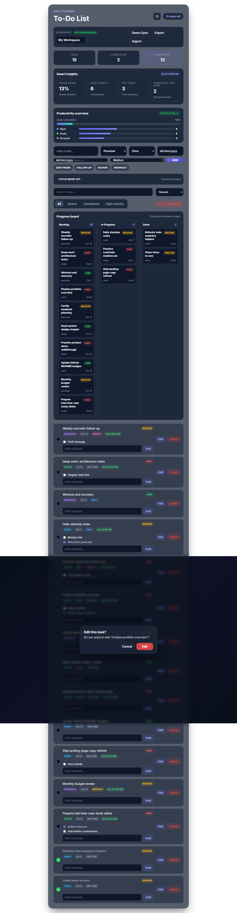

### 15. Mobile responsive layout

Phone-width layout keeps metrics, composer, board, and task actions usable on small screens.

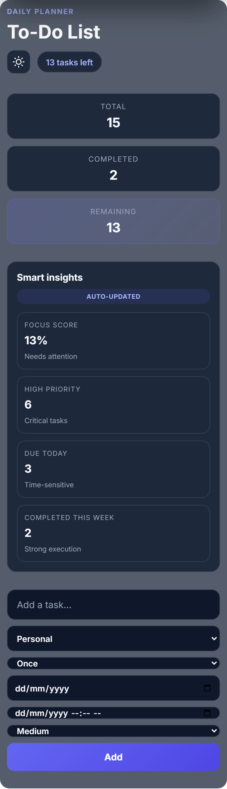

---

## Overview

This project is designed to feel like a professional portfolio piece while staying lightweight and easy to run. It is a single-page app with local browser persistence, no backend dependency, and no authentication required.

The goal is to make it feel premium, usable on any device, and strong enough to showcase front-end design, UX thinking, and interactive product behavior in a portfolio or interview demo.

## Why this project stands out

- Clean, modern UI inspired by productivity dashboards
- Fully responsive across mobile, tablet, and desktop
- Advanced filtering and sorting controls
- Drag-and-drop task board for plan execution
- Recurring tasks that automatically roll the due date forward
- Reminder support with toast feedback
- Smart insights panel with progress analytics
- Focus mode for today's priorities
- Quick task shortcuts for frequent workflows
- Export/import for JSON workflow portability
- Confirmation dialogs before destructive or edit actions
- Local persistence using browser storage
- Seeded demo workspace with 15 sample tasks covering every feature

## Features (deep dive)

### Productivity dashboard

The top of the app is a decision surface, not just decoration.

- **Total / Completed / Remaining** cards recalculate after every create, edit, complete, delete, import, or board move.
- A **completion rate** percentage and progress fill show how close the current cycle is to “inbox zero.”
- Category rows visualize how work is distributed across `work`, `personal`, and `study`.

### Smart insights

Insight cards translate raw counts into coaching-style notes:

| Insight | What it measures | Why it helps |
| --- | --- | --- |
| Focus score | Completed ÷ total | Momentum signal for the current backlog |
| High priority | Count of `high` tasks | Risk / urgency load |
| Due today | Tasks dated today | Same-day execution pressure |
| Completed this week | Recently finished work | Weekly execution proof |

Each card includes a short note (for example “Excellent momentum” or “Needs attention”) so recruiters can see UX copy, not only numbers.

### Task management

Every task can carry:

- **Title** (required)
- **Category** (`personal`, `work`, `study`)
- **Priority** (`high`, `medium`, `low`)
- **Due date**
- **Reminder** (`datetime-local`)
- **Recurrence** (`none`, `daily`, `weekly`, `monthly`)
- **Board status** (`backlog`, `inProgress`, `done`)
- **Subtasks** with independent completion state

You can search by keyword, sort by newest/oldest/priority/due soon, mark complete/incomplete, edit, delete, and clear completed items.

### Confirmation safeguards (edit / delete)

Destructive and mutation flows are protected:

1. **Delete** opens a modal: confirm with **OK/Delete** or abort with **Cancel**.
2. **Edit** asks permission before entering edit mode.
3. **Save edit** asks again before writing the new title.
4. **Clear completed** also requires confirmation and reports how many tasks will be removed.

Backdrop click and `Escape` cancel the dialog. This prevents accidental data loss during demos.

### Progress board stages: Backlog, In Progress, Done

The **Progress board** is a Kanban-style workflow. Every task always sits in exactly one stage. You can drag cards between columns (or change status via completion) to move work through the pipeline.

#### What counts as Backlog work?

**Backlog** = work that is planned but **not started yet**.

Typical backlog tasks:
- Ideas and queued work waiting for capacity
- Tasks you intend to do later this week
- Items that are blocked or not prioritized for "right now"
- Newly added tasks (default stage when you create a task)

In this app, backlog means:
- `status: "backlog"`
- usually **not completed**
- visible in the **Backlog** column on the board
- still counted in Remaining (unless completed)

Examples from the seeded demo:
- "Finalize portfolio overview"
- "Practice product demo walkthrough"
- "Read system design chapter"

Use Backlog when the task exists on your radar, but you have not actively started executing it.

#### What counts as In Progress work?

**In Progress** = work you are **currently executing**.

Typical in-progress tasks:
- The task open on your screen right now
- Work already started, partially done, or mid-session
- Items with active subtasks being checked off
- Recurring routines you are handling in this cycle (for example today's standup)

In this app, in progress means:
- `status: "inProgress"`
- not finished yet
- visible in the **In Progress** column
- still counted as Remaining until completed / rolled forward

Examples from the seeded demo:
- "Weekly recruiter follow-up"
- "Daily standup notes"
- "Ship landing-page copy refresh"
- "Practice LeetCode medium set"

Use In Progress when the task has left "waiting" and entered "doing."

#### What counts as Done work?

**Done** = finished for this cycle (or permanently finished if it is a one-time task).

- `status: "done"` and/or `completed: true`
- appears in the **Done** column
- counted under Completed metrics
- can be removed in bulk with **Clear completed** (after confirmation)

#### How tasks move between stages

1. **Drag and drop** a board card onto another column.
2. **Check the task checkbox**:
   - one-time task -> moves to Done
   - recurring task -> due date rolls forward and task returns toward Backlog for the next cycle (see below)
3. Filters / Focus mode change *visibility*, not the underlying stage meaning.

| Stage | Meaning | When to use | Board column |
| --- | --- | --- | --- |
| Backlog | Queued / not started | Future or waiting work | Backlog |
| In Progress | Actively being worked | Current focus session | In Progress |
| Done | Finished | Completed outcomes | Done |

### Recurring tasks and due-date extension (check -> date moves forward)

This is the special behavior: **on some checkboxes, completing the task advances the due date instead of leaving it permanently completed.**

#### Which tasks do this?

Only tasks whose recurrence is **not** `Once`:

| Recurrence badge | Checkbox behavior | Due date change |
| --- | --- | --- |
| **Once** (`none`) | Normal complete -> Done | No date change |
| **Daily** | Stays active for next day | Due date + **1 day** |
| **Weekly** | Stays active for next week | Due date + **7 days** |
| **Monthly** | Stays active for next month | Due date + **1 month** |

So: if the task card shows **Daily**, **Weekly**, or **Monthly**, checking it triggers date roll-forward. If it shows **One-time** / Once, checking it completes normally.

#### Exact flow when you click the checkbox on a recurring task

1. You click the task checkbox.
2. The app detects `recurrence` is `daily`, `weekly`, or `monthly`.
3. It does **not** keep the task in a permanent Completed/Done state for that cycle end.
4. Instead it:
   - keeps the task **active**
   - sets status back toward **Backlog** for the next cycle
   - computes a new `dueDate` with `addRecurrence(...)`
   - shows a toast such as: `Recurring (weekly): due date moved to ...`
5. Analytics stay consistent because the task is still open work for the next occurrence.

#### Demo tasks you can use to try it

Seeded recurring examples:
- **Daily standup notes** (`daily`) - check -> due date becomes tomorrow
- **Workout and recovery** (`daily`)
- **Weekly recruiter follow-up** (`weekly`) - check -> due date jumps ~7 days
- **Practice LeetCode medium set** (`weekly`)
- **Monthly budget review** (`monthly`) - check -> due date jumps ~1 month

One-time contrast example:
- **Finalize portfolio overview** (`none` / Once) - check -> moves to Done, date does **not** extend

#### Why this design exists

Recurring work (standups, workouts, weekly follow-ups) should not disappear after one check. Checking means "done for this occurrence," so the app schedules the **next occurrence** by extending the due date automatically.

### Reminders and toasts

Reminders use the browser clock. When a reminder time is reached (while the tab is open), a toast surfaces the task title. Action toasts also confirm adds, edits, deletes, imports, exports, focus toggles, board moves, and recurring date roll-forwards.

### Workflow organization (summary)

- **Progress board** stages: Backlog (queued), In Progress (active), Done (finished)
- Drag a board card onto another stage to update status
- Completing via board/list keeps analytics and list filters in sync
- Recurring checkbox completion rolls the due date forward (daily/weekly/monthly only)
- Filter tabs: All, Active, Completed, High Priority
- **Focus mode** reduces noise to today's open work

### Export / Import

- **Export** downloads the current task array as JSON
- **Import** restores a previously exported file
- Useful for backups or moving a demo dataset between machines/browsers

### Theme and workspace chrome

- Light/dark theme toggle persisted in `localStorage`
- Workspace name field for personalizing the demo identity
- "Demo Sync" saves workspace metadata locally (no cloud account required)

## Seeded demo tasks

On first load (or after storage key upgrade), the app seeds **15 tasks**, including:

- High-priority portfolio and interview prep work
- Daily standup + workout recurrences
- Weekly recruiter follow-up / LeetCode loops
- Monthly budget review
- Mixed board statuses (backlog, in progress, done)
- Overdue and due-today examples
- Subtasks on several cards

This makes screenshots, demos, and recruiter walkthroughs useful immediately.

## Tech stack

- HTML5
- CSS3
- Vanilla JavaScript
- LocalStorage for persistence
- GitHub Pages for deployment
- GitHub Actions for automated static site deployment

## Project structure

```text
.
├── index.html                 # App structure, composer, board, confirm modal
├── style.css                  # Responsive styling + confirmation dialog
├── script.js                  # State, analytics, recurrence, confirms, storage
├── live-demo.html             # Pages entry helper
├── README.md                  # Documentation + feature screenshots
├── docs/screenshots/          # 15 feature screenshots
├── .gitignore
└── .github/workflows/
    └── deploy-pages.yml
```

## Local setup

1. Clone the repository:

```bash
git clone https://github.com/rohaan2802/TODO-Web-App.git
cd TODO-Web-App
```

2. Open `index.html` in your browser, or run a simple local server:

```bash
python -m http.server 8000
```

3. Visit `http://localhost:8000` in the browser.

## Deployment

This project is deployed to GitHub Pages using a GitHub Actions workflow.

### GitHub Pages workflow

The deployment workflow is defined in:

- `.github/workflows/deploy-pages.yml`

It automatically publishes the static site when changes are pushed to the `main` branch.

Live site:

https://rohaan2802.github.io/TODO-Web-App/

## GitHub profile and repository

- Profile: https://github.com/rohaan2802
- Repository: https://github.com/rohaan2802/TODO-Web-App

## Future enhancements

Potential next upgrades for a production-grade version include:

- Real authentication and user accounts
- Cloud sync using a backend database
- Advanced charts and reporting dashboards
- Calendar and timeline view
- Task sharing or team collaboration
- Native browser/device push reminders
- Undo stack for delete/clear actions

## Author

Rohaan Arshad

## License

This project is for educational and portfolio demonstration purposes.
